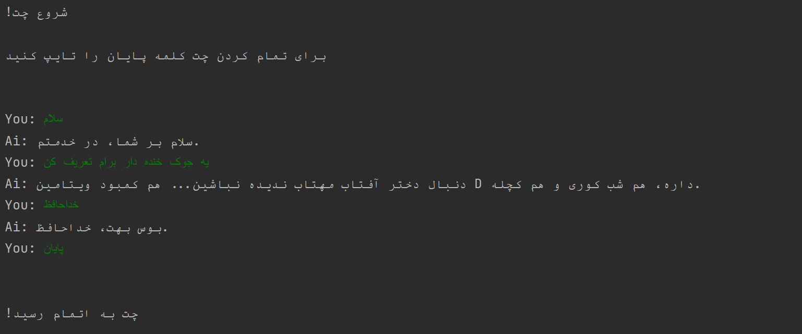

# Chat-Bot
*The simplest Chat Bot in Persian with Pytorch.*

  <h2> How does output looks like?</h2>
  
  
In this case we just use the most basic methods for bulding a chat bot.  embedding: one_hot  model: mlp  
  There is a `data.json` file, it contains data which we train on. for changing the capabalities of bot you can edit this file and then running `train.py` file. But before train on your data, you probably need to change the model structure in `model.py` file.  
    So for fine tunning this chat bot on your data, follow these steps:  
    1) modify the `data.json` file.  
    2) modify the model structure in `model.py file.`  
    3) run `train.py` file.  
    4) run `main.py` file and chat with bot.

<em>You can run this project in pycharm to see chats in Persian.</em>
